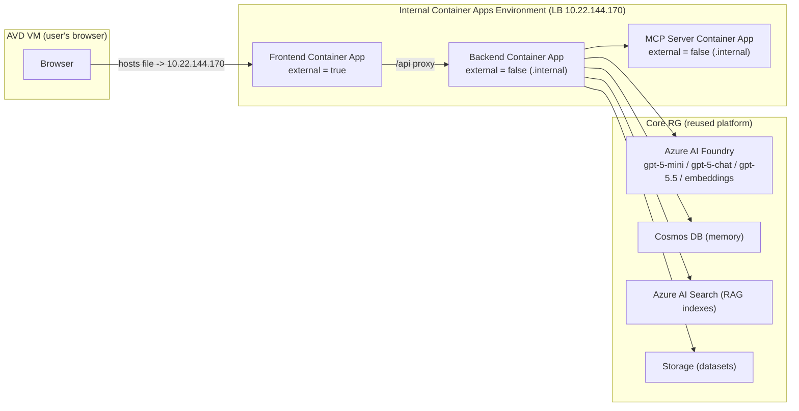
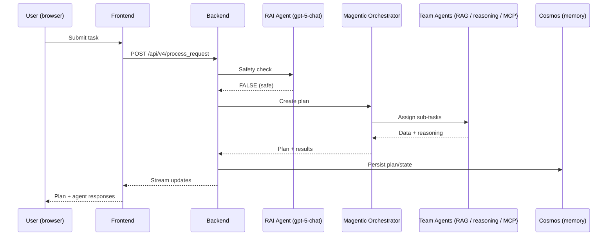

# MACAE Deployment into the RPSI Private AI Landing Zone — End‑to‑End Guide

**Solution:** Multi‑Agent Custom Automation Engine (MACAE)
**Environment:** RPSI Digital Manufacturing — Azure, West Europe (`westeurope`)
**Deployment model:** App layer deployed into an **existing private AI landing zone** (maximum reuse of shared platform resources; only the application tier is created new).
**Deployment tool:** `az deployment group create` with a custom Bicep template (`infra/main_reuse.bicep`) — **not** `azd`.

---

## 1.  What this deployment is

MACAE is a web application in which a user describes a business task in natural language, and a team of AI agents collaboratively produces and executes a step‑by‑step plan. The platform pieces (AI models, database, search, storage, networking) already existed in the RPSI landing zone. We only added the **three application containers** and wired them to the shared platform.



---

## 2. What was **reused** vs **created new**

### Reused (already in the landing zone — nothing recreated)
| Resource | Name | Purpose in MACAE |
|---|---|---|
| Azure AI Foundry (AI Services) | `aif-foundry-rpsi-dev-weu-01` (project `DigitalManufacturing`) | Hosts the models and the server‑side agents |
| Model deployments | `gpt-5-mini`, `gpt-5-chat`, `gpt-5.5`, `text-embedding-3-large` | Agent reasoning, RAI safety check, embeddings for search |
| Cosmos DB | `cosmos-foundry-rpsi-dev-weu-01` | Conversation/plan **memory** store |
| Azure AI Search | `srch-foundry-rpsi-dev-weu-01` | **RAG** indexes for agent knowledge |
| Storage Account | `stfoundryrpsidweu01` | Holds the raw datasets that feed the indexes |
| Container Apps Environment | `cae-foundry-rpsi-dev-weu-01` (internal, static IP `10.22.144.170`) | Runtime for the 3 app containers |
| Azure Container Registry | `acrdigitalmfgrpsidweu01` | Stores the app container images |
| User‑Assigned Managed Identity | `uai-aci-pull-digitalmfg-rpsi-dev-weu-01` | Image pull + data‑plane auth to Foundry/Cosmos/Search/Storage |
| Private Endpoints / VNet | (landing zone) | All traffic stays private within the VNet |

### Created new (only the application tier, in `rg-gen-digitalmfg-rpsi-dev-weu-01`)
| Resource | Name | Ingress |
|---|---|---|
| Frontend Container App | `ca-macae-fe-rpsi-dev-weu-01` | `external = true` (browser‑facing) |
| Backend Container App | `ca-macae-be-rpsi-dev-weu-01` | `external = false` (`.internal`) |
| MCP Server Container App | `ca-macae-mcp-rpsi-dev-weu-01` | `external = false` (`.internal`) |
| Cosmos database + container | DB `macae`, container `memory` (partition `/session_id`) | on the reused Cosmos account |
| Container images | `macae-frontend`, `macae-backend`, `macae-mcp` | pushed to the reused ACR |

> **RBAC note:** The reused managed identity already held every required role (ACR pull, Cosmos SQL data‑plane, Foundry, Search Index Data Contributor, Storage Blob Data Contributor), so the optional `reuse-rbac.bicep` module was gated off (`deployRbac=false`).

---

## 3. Files created for this deployment

| File | Role |
|---|---|
| `infra/main_reuse.bicep` | Orchestrator — 3 Container Apps + gated modules, wires env vars to reused resources |
| `infra/modules/reuse-cosmos.bicep` | Creates DB `macae` + container `memory` on the existing Cosmos account |
| `infra/modules/reuse-rbac.bicep` | (Gated) UAI role assignments on Foundry/Search/Storage |
| `infra/main_reuse.parameters.json` | All discovered resource names/IDs/endpoints for the landing zone |
| `src/backend/Dockerfile.reuse` + `entrypoint.sh` | Backend image; injects `/etc/hosts` for private FQDN resolution |
| `src/mcp_server/Dockerfile.reuse` | MCP image; runs `python mcp_server.py` directly (non‑root friendly) |
| `infra/scripts/Load-ReuseData.ps1` | Self‑contained data loader (datasets → Storage, build Search indexes, upload team configs) |

---

## 4. Step‑by‑step: how it was deployed

### Step 0 — Discover the landing zone
Recorded every reusable resource (Foundry, Cosmos, Search, Storage, CAE, ACR, UAI), the CAE default domain (`purplebay-8719396f.westeurope.azurecontainerapps.io`), static IP (`10.22.144.170`), and private‑endpoint IPs. All captured in `main_reuse.parameters.json`.

### Step 1 — Build & push the three images
```powershell
az acr build --registry acrdigitalmfgrpsidweu01 --image macae-backend:reuse-4  --file src/backend/Dockerfile.reuse  src/backend
az acr build --registry acrdigitalmfgrpsidweu01 --image macae-mcp:reuse-2      --file src/mcp_server/Dockerfile.reuse src/mcp_server
az acr build --registry acrdigitalmfgrpsidweu01 --image macae-frontend:reuse-1 --file src/App/Dockerfile.reuse       src/App
```
Notes learned:
- ACR classic builder has **no BuildKit** → removed `RUN --mount=type=cache` lines.
- Frontend needed Node 18 → 22 for Vite 7.
- MCP must start with `python mcp_server.py` (not `uv run`) because it runs as a non‑root user.

### Step 2 — Deploy the app tier
```powershell
az deployment group create `
  -g rg-gen-digitalmfg-rpsi-dev-weu-01 `
  -n macae-reuse `
  --template-file infra/main_reuse.bicep `
  --parameters "@infra/main_reuse.parameters.json" deployRbac=false `
  --query "properties.provisioningState" -o tsv
```
This creates the 3 Container Apps + the Cosmos `macae`/`memory` container and wires all environment variables (model names, endpoints, Cosmos, Search, Storage, MCP URL, backend URL).

### Step 3 — Fix container startup issues
- Backend crashed on a required (but empty) App Insights connection string → added empty `APPLICATIONINSIGHTS_CONNECTION_STRING` / `..._INSTRUMENTATION_KEY` env vars (monitoring off).
- MCP startup probe fixed by the `python mcp_server.py` change above.
- Redeployed → all three **Healthy / Running**.

### Step 4 — Get the networking right (ingress model)
The CAE is **internal** (no public IP). The correct pattern for an internal environment:
- **Frontend** = `external = true` → reachable by the AVD VM browser at its FQDN, which resolves to the environment load balancer `10.22.144.170` (added to the VM's `hosts` file). Still private to the VNet.
- **Backend + MCP** = `external = false` → `.internal` FQDNs so app‑to‑app calls resolve to the same env LB (public FQDNs are unreachable container‑to‑container on an internal env).

`BACKEND_API_URL` and `MCP_SERVER_ENDPOINT` use the dynamic `.ingress.fqdn`, so they auto‑resolve to the correct `.internal` hostnames.

### Step 5 — Load the data (run from the AVD VM)
`Load-ReuseData.ps1` (hardened for Windows PowerShell 5.1) did, from the VM that has private access:
1. Uploaded datasets to **Storage** (auto‑creating blob containers).
2. Built **Azure AI Search** indexes (embeddings via `text-embedding-3-large`).
3. Uploaded the 5 **team configuration** JSON files to the backend (`POST /api/v4/upload_team_config`).

Result — **0 failures**:
- **5 team configs**: HR, Marketing, RFP, Contract Compliance, Retail.
- **8 blob containers + 8 Search indexes**: RFP (summary/risk/compliance), Contract Compliance (summary/risk/compliance), Retail customer, Retail order.

### Step 6 — Make the agents actually run (the model‑parameter saga)
Three sequential fixes were needed because this Foundry deployment's **entire GPT‑5 family rejects the `temperature` parameter**:
1. **gpt‑5‑mini** (agents) rejected `temperature` → added `_model_supports_temperature()` to omit it for reasoning/GPT‑5 models.
2. **gpt‑5‑chat** (RAI safety agent) *also* rejected it → removed the "chat" exception so **all** `gpt-5*` omit temperature.
3. **Root cause finally:** Foundry agents are **persistent and store their settings server‑side**. Because the client uses `use_latest_version=true`, it kept **replaying the stale agent version** (created on the first deploy with `temperature=0.1` baked in), so code changes never took effect. Fix: a **one‑time per‑process purge** (`agents.delete`) that removes the stale server‑side agent on first init, forcing Foundry to recreate it cleanly from the corrected definition. Shipped as `macae-backend:reuse-4`.

After Step 6, task submission produces a plan and the chat works end‑to‑end.

---

## 5. How it works for the user

1. The user opens the **frontend URL** in the AVD VM browser:
   `https://ca-macae-fe-rpsi-dev-weu-01.purplebay-8719396f.westeurope.azurecontainerapps.io/`
   (the VM `hosts` file maps this FQDN → `10.22.144.170`).
2. The UI lists the **teams** (HR, Marketing, RFP, Contract Compliance, Retail). The frontend proxies `/api/*` to the internal backend.
3. The user picks a team and submits a task (typed, or a "Quick task").
4. The backend runs a **Responsible‑AI safety check** (RAI agent, `gpt-5-chat`). If it passes, the **Magentic orchestrator** builds a plan and assigns sub‑tasks to the specialized agents.
5. Agents collaborate: **RAG agents** answer from their Search indexes, **reasoning agents** synthesize, and **MCP‑enabled agents** call tools via the MCP server. Progress and the plan appear live in the UI.
6. Conversation state and plans persist in **Cosmos DB** (`macae/memory`).



---

## 6. What data was loaded (and which agents use it)

| Domain | Storage container → Search index | Example contents | Consuming team/agent |
|---|---|---|---|
| Retail — customer | `macae-retail-customer-index` (11 files) | Customer profiles, service interactions, feedback surveys, churn analysis, loyalty, social sentiment, store visits, website activity | **CustomerDataAgent** (Retail) |
| Retail — order | `macae-retail-order-index` (6 files) | Purchase history, product table, return rates, delivery performance, competitor pricing, warehouse incidents | **OrderDataAgent** (Retail) |
| RFP | summary (1) / risk (2) / compliance (2) | RFP analysis documents | RFP team agents |
| Contract Compliance | summary (1) / risk (2) / compliance (2) | Contract documents | Contract Compliance team agents |
| Team configs | Backend (`/api/v4/upload_team_config`) | 5 JSON team definitions (agents, models, tools, starting tasks) | Orchestrator / UI |

> The reasoning agents (e.g. Retail's **AnalysisRecommendationAgent**, `use_reasoning=true`) have **no index** of their own — they call the RAG agents to gather facts, which is what produces visible multi‑agent interaction.

---

## 7. Key endpoints & identifiers

| Item | Value |
|---|---|
| Subscription | `cf397678-b660-4714-bea3-5e5b7748bce2` |
| Deploy RG | `rg-gen-digitalmfg-rpsi-dev-weu-01` |
| Core (platform) RG | `rg-core-foundry-rpsi-dev-weu-01` |
| CAE domain / static IP | `purplebay-8719396f.westeurope.azurecontainerapps.io` / `10.22.144.170` |
| Frontend URL | `https://ca-macae-fe-rpsi-dev-weu-01.purplebay-8719396f.westeurope.azurecontainerapps.io/` |
| Backend health path | `/healthz` |
| Foundry project endpoint | `https://aif-foundry-rpsi-dev-weu-01.services.ai.azure.com/api/projects/DigitalManufacturing` |
| Models | `gpt-5-mini` (agents + reasoning), `gpt-5-chat` (RAI), `gpt-5.5`, `text-embedding-3-large` |

---

## 8. Redeploy / update cheat‑sheet

```powershell
# 1. Rebuild the changed image (bump the tag)
az acr build --registry acrdigitalmfgrpsidweu01 --image macae-backend:reuse-N `
  --file src/backend/Dockerfile.reuse src/backend

# 2. Point the parameter at the new tag
#    infra/main_reuse.parameters.json  ->  "backendImage": { "value": "macae-backend:reuse-N" }

# 3. Redeploy the app tier
az deployment group create -g rg-gen-digitalmfg-rpsi-dev-weu-01 -n macae-reuse `
  --template-file infra/main_reuse.bicep `
  --parameters "@infra/main_reuse.parameters.json" deployRbac=false `
  --query "properties.provisioningState" -o tsv

# 4. Verify
az containerapp revision list -n ca-macae-be-rpsi-dev-weu-01 -g rg-gen-digitalmfg-rpsi-dev-weu-01 `
  --query "[?properties.active].{rev:name,health:properties.healthState,running:properties.runningState}" -o table
```

---

## 9. Gotchas worth remembering

- **Internal CAE ingress:** only the browser‑facing app is `external=true`; all app‑to‑app must be `external=false` (`.internal`). Public FQDNs don't work container‑to‑container on an internal environment.
- **GPT‑5 family rejects `temperature`** on this Foundry deployment — omit it entirely.
- **Foundry agents are persistent**; with `use_latest_version=true` the server‑side definition wins over client code. Purge the agent to force a fresh version after changing its settings.
- **ACR classic builder** has no BuildKit → no `--mount=type=cache`.
- **Data load must run from the AVD VM** (it has private access to the endpoints); local machines have no route to `10.22.144.170`.
- **MCP** must launch via `python mcp_server.py` (non‑root user can't `uv run`‑sync at startup).
